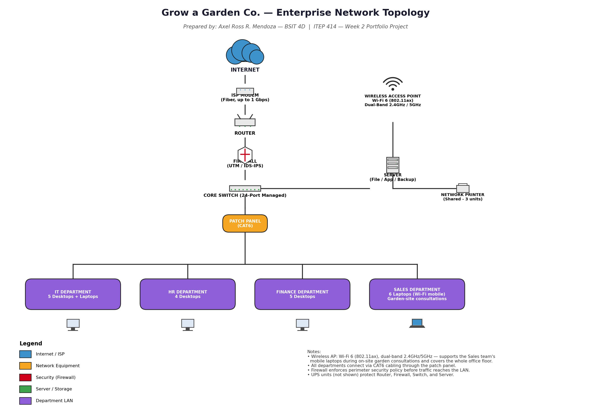

# Enterprise Infrastructure Planning for a Startup Company

**ITEP 414 – System Administration and Maintenance**
**Week 2 Portfolio Project**

**Name:** Axel Ross R. Mendoza
**Section:** BSIT 4D
**Instructor:** Sir John Randolf M. Peñaredondo, MIT

---

## Project Overview

I had just been hired as a Junior System Administrator when management at **Grow a Garden Co.** gave me my first major assignment: plan the company's entire IT infrastructure from the ground up. The startup had no computers, no server, no network, and no security policies in place, so I had to design everything from scratch, from the hardware to the network layout.

## Learning Objectives

Through this project, I aimed to explain the roles and responsibilities of a System Administrator, identify the hardware, software, and networking requirements of a small business, prepare a professional IT inventory, design an enterprise network topology, and create technical documentation using Markdown.

## Company Scenario

Grow a Garden Co. is a newly established gardening and landscaping startup with 20 employees spread across four departments: Information Technology with 5 employees, Human Resources with 4, Finance with 5, and Sales with 6, for a total of 20. The company sells plants and gardening supplies online and also offers landscaping consultations to clients.

## Hardware Inventory Summary

I listed out all the equipment the company would need, including desktop computers, laptops, a server, router, switches, printers, UPS units, a wireless access point, NAS storage, a backup drive, and monitors, enough to support all 20 employees plus shared office equipment. Full details are documented in `EnterpriseInfrastructurePlan.pdf` (Part 2).

## Software Inventory Summary

I also selected the software the company would rely on, including Windows 11 Pro, Ubuntu Server, Microsoft Office, VS Code, Git, GitHub Desktop, VirtualBox, Google Chrome, Microsoft Defender, AnyDesk, and 7-Zip. The complete list is in `EnterpriseInfrastructurePlan.pdf` (Part 3).

## Embedded Network Diagram

I designed the network topology so that the internet connection flows from the ISP modem, through the router and firewall, before reaching the core switch, which then connects to the server, wireless access point, printer, and all four department LANs. I chose Wi-Fi 6 (802.11ax) for the wireless access point since it can support multiple devices connecting at once, especially for the Sales team, who frequently bring their laptops along on garden-site visits.

## Technologies Used

For this project, I used Draw.io and Python to build the network diagram, Microsoft Word to write the report, and Git and GitHub for version control.

## Challenges Encountered

The most difficult part for me was building a clear and accurate network diagram. I had to make sure the connections were logical and that the firewall was correctly positioned before traffic reached the switch and the departments.

## Reflection

My full reflection on what I learned from this project can be found in `EnterpriseInfrastructurePlan.pdf` (Part 8).

## References

CompTIA (https://www.comptia.org/), Cisco (https://www.cisco.com/), Red Hat (https://www.redhat.com/), and Microsoft Learn (https://learn.microsoft.com/) were used as references for the certifications and technical concepts discussed in this project.
